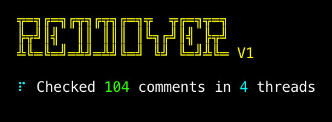

# Reddover

Python bot to delete or remove comments on Reddit which have been downvoted.

### Requirements

- Python 3

### Install dependencies

    pip install -r requirements.txt

### Fill in the blanks     

Create a Reddit script app at https://old.reddit.com/prefs/apps/

- Enter all your juicy Reddit details into config.ini
- All boolean (true/false) options are 1/0
- Choose maximum downvotes for each comment
- Limit is how many threads to check can be a number or "None"
- Delete option switches between delete or remove.
- Sleep timer option is in minutes

### Run it

    python3 run.py
